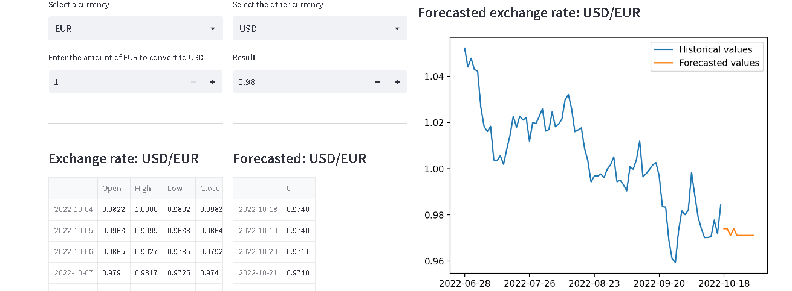

# Forecast Exchange Rate
===========

## Description
This is a machine learning project that forecast the daily exchange rate between the most traded currencies. 
The dashboard produced by this project has these features:
* The user can select the two currencies for which he wants to forecast the daily exchange rate.
* A currency converter is provided, allowing the user to add the amount of the first chosen currency he wants to convert to the other currency.
* The values (Open, Low, High, Close) of the exchange rate for the currencies selected by the user
are provided in a table, for the last 10 days.
* The forecasted values of the exchange rate are provided in a table.
* A graphic present the historical values of the exchange rate, for the last 90 days, and the forecasted values for 10 future days.

 
## Modules required to run the code
* pandas
* numpy
* matplotlib
* scipy
* scikit-learn
* requests
* seaborn
* statsmodels
* streamlit

## Method
### API required to retreive data
To realize this project, data are retrieved, using two APIs. One from AlphaVantage to get daily exchange rate, and another One
from the FRED API of the Federal Reserve Bank of St. Louis. The FRED API is used to retreive daily time series to be used as features
to train and test the machine learning algorithm chosen. These APIs are used in the project without any dedicated python module. Data imported
have been converted to a structured data frame, using the modules json, requests, and pandas.

### Machine learning
